# RexScript

RexScript is an agent-centric, risk-governed programming language that transpiles to JavaScript and runs with runtime policy controls, execution traces, and deterministic diagnostics.

This repository provides the compiler pipeline, runtime packages, integration suite, and release-phase scaffolding.

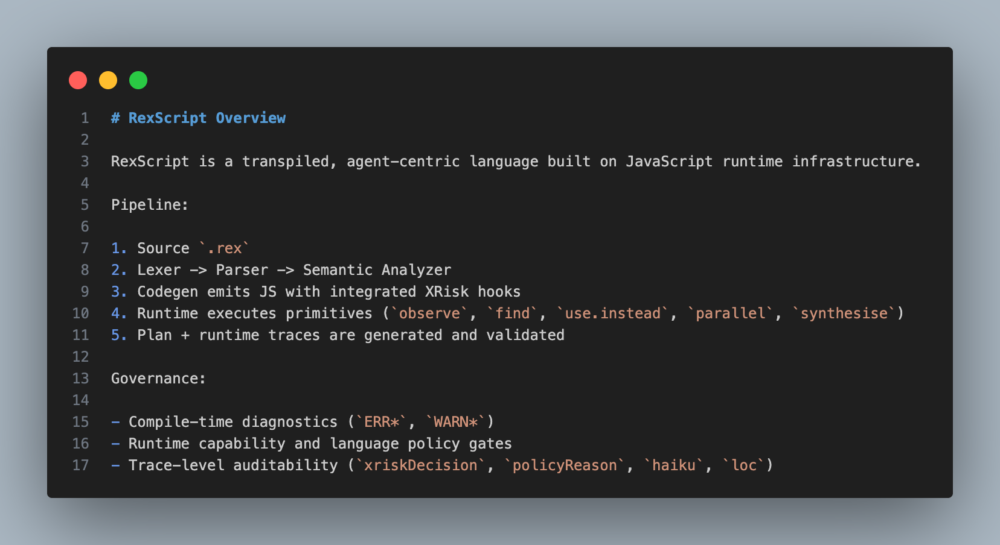

## Table Of Contents

- [What RexScript Is](#what-rexscript-is)
- [Current Implementation Status](#current-implementation-status)
- [Architecture](#architecture)
- [Project Structure](#project-structure)
- [Quick Start](#quick-start)
- [Language Examples](#language-examples)
- [Compiler And Runtime Commands](#compiler-and-runtime-commands)
- [Policy And Risk Governance](#policy-and-risk-governance)
- [Tracing Model](#tracing-model)
- [Dynamic Feature Lifecycle](#dynamic-feature-lifecycle)
- [Validation Suite](#validation-suite)
- [Screenshots And CodeSnap Workflow](#screenshots-and-codesnap-workflow)
- [Roadmap Docs](#roadmap-docs)

## What RexScript Is

RexScript is a real language (not just a script collection) because it has:

- A defined grammar: [spec/rexscript-v0.1.ebnf](spec/rexscript-v0.1.ebnf)
- A parser and AST contracts: [compiler/src/parser.js](compiler/src/parser.js), [compiler/contracts/ast-nodes.json](compiler/contracts/ast-nodes.json)
- Semantic diagnostics and policy gates: [compiler/src/semantic.js](compiler/src/semantic.js), [compiler/contracts/diagnostics.json](compiler/contracts/diagnostics.json)
- Code generation targeting JavaScript: [compiler/src/codegen.js](compiler/src/codegen.js)
- Runtime behavior and risk controls: [packages/runtime/index.js](packages/runtime/index.js), [packages/xrisk/index.js](packages/xrisk/index.js)

## Current Implementation Status

- Phase 1: Completed (grammar + AST + diagnostics contracts + fixtures)
- Phase 2: Completed (compiler core + snapshots + integration pipeline)
- Phase 3: In progress (runtime fidelity and trace quality)
- Phase 4: In progress (use.instead adapters and integration hardening)
- Phase 5: Started (dynamic feature lifecycle + release-readiness gates)

## Architecture

Compiler flow:

1. Lexer tokenizes source
2. Parser emits typed AST nodes
3. Semantic analyzer enforces language rules and policy checks
4. Codegen emits JavaScript with embedded XRisk hooks
5. Runtime executes primitives and emits runtime trace artifacts

Runtime governance flow:

1. `before` risk evaluation (capabilities, prompt/tamper checks, policy allowlists)
2. Primitive execution (`observe`, `find`, `use.instead`, `parallel`, `synthesise`)
3. `after` risk evaluation and trace summarization
4. Trace persistence (`traceId`, `sessionId`, `actions`, `diagnostics`)

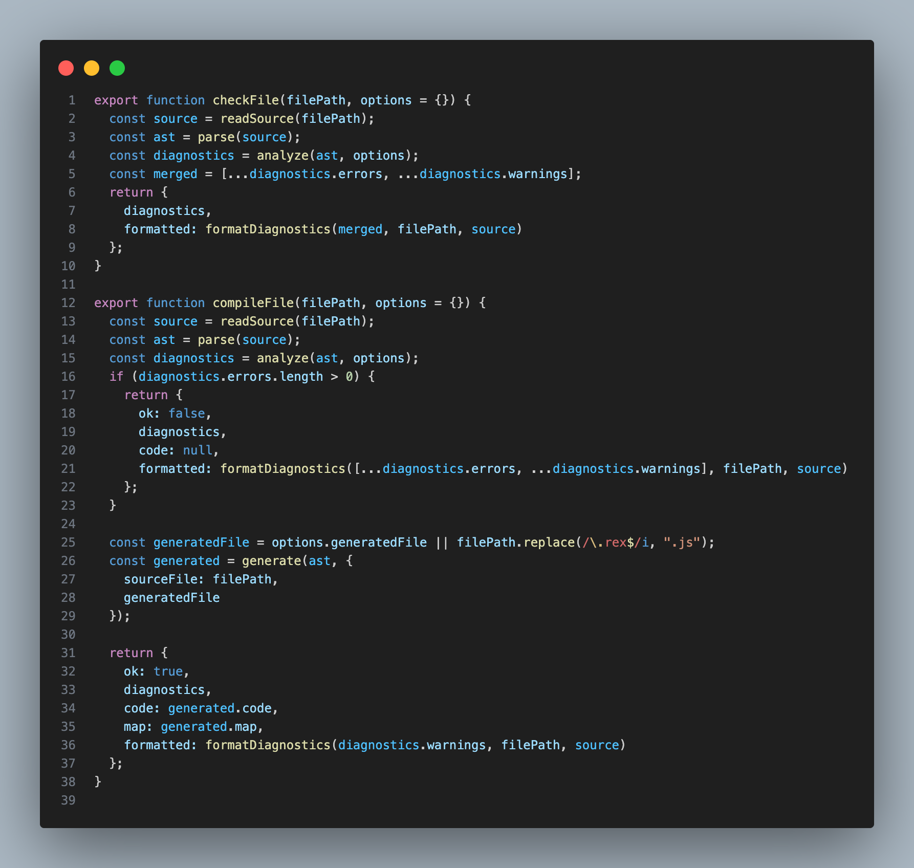

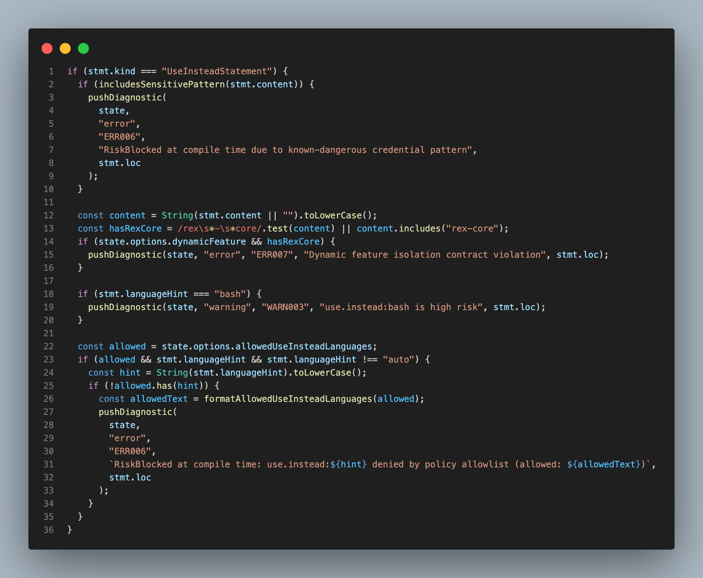
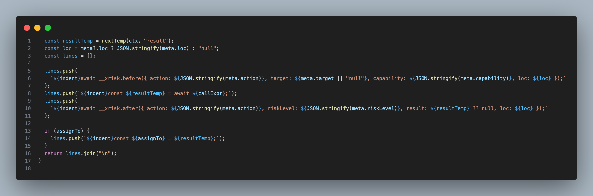

## Project Structure

Top-level map:

- [compiler](compiler): lexer, parser, semantic analysis, codegen, CLI scripts
- [packages/runtime](packages/runtime): execution primitives and use.instead adapters
- [packages/xrisk](packages/xrisk): runtime policy decisions and trace sink
- [packages/rosetta](packages/rosetta): language scoring/detection helpers
- [tests/fixtures](tests/fixtures): valid, invalid, warning fixture corpus
- [tests/integration](tests/integration): integration pipeline and checks
- [docs](docs): roadmap and phase prep docs
- [assets](assets): screenshot assets and CodeSnap chunk sources


## Quick Start

Run from [compiler](compiler):

```bash
cd rexscript/compiler
npm install

npm run phase1:smoke
npm run rex:check -- ../tests/fixtures/valid/when_use_instead.rex
npm run rex:compile -- ../tests/fixtures/valid/when_use_instead.rex ./.rex-run/quickstart.js default --map
npm run rex:run -- ../tests/fixtures/valid/when_use_instead.rex default --trace-out ../tests/integration/quickstart.runtime.trace.json
npm run rex:trace -- ../tests/fixtures/valid/when_use_instead.rex ../tests/integration/quickstart.plan.trace.json default
```


## Language Examples

Basic flow with observation, conditional branch, synthesis, and recovery:

```rex
try {
	observe page "https://example.com/data" as $page

	when $page is loaded {
		find "Latest headlines" in $page as $headlines
		synthesise [$page, $headlines] as $summary
	} otherwise {
		flag $page as unavailable
		skip
	}
} catch * {
	emit { action: "fallback" }
	skip
}
```

`use.instead` with explicit language and fallback:

```rex
try {
	use.instead:sql as $rows {
		SELECT id, title FROM posts LIMIT 5
	} catch QueryFailed {
		use default []
	}

	synthesise [$rows] as $report
} catch * {
	emit { action: "fallback" }
	skip
}
```

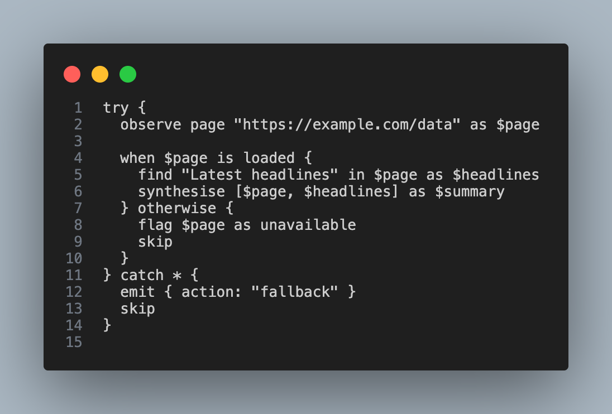
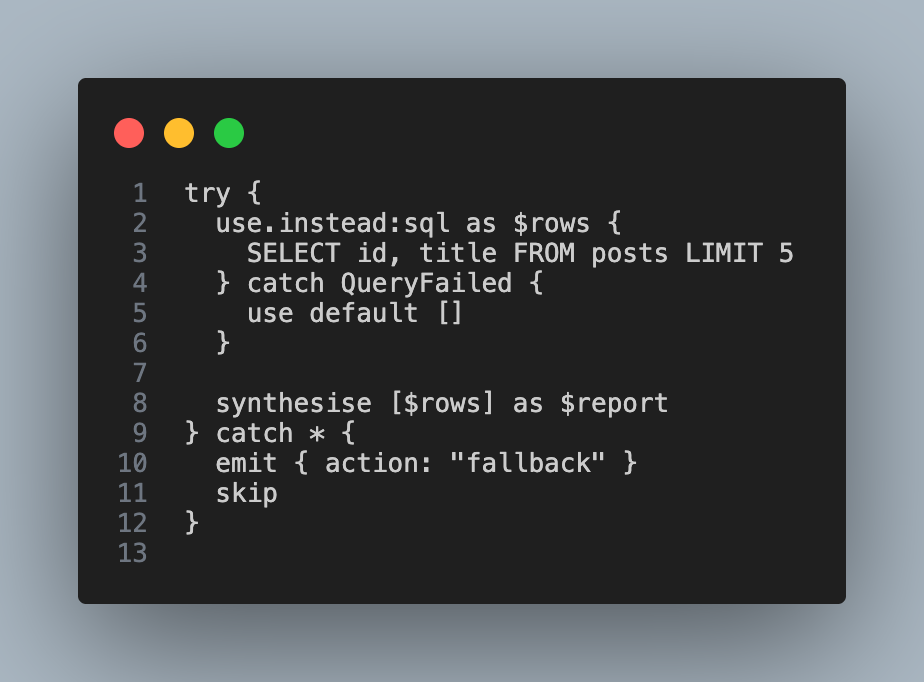

## Compiler And Runtime Commands

From [compiler/package.json](compiler/package.json):

### Core

- `npm run rex:check -- <file.rex> [default|strict|dynamic]`
- `npm run rex:compile -- <file.rex> [out.js] [default|strict|dynamic] [--map]`
- `npm run rex:run -- <file.rex> [default|strict|dynamic] [--dry-run] [--trace-out <file.json>]`
- `npm run rex:trace -- <file.rex> [out.json] [default|strict|dynamic]`

### Snapshot/Test

- `npm run phase1:smoke`
- `npm run codegen:snapshots`
- `npm run codegen:snapshots:update`

### Integration

- `npm run integration:run`
- `npm run integration:trace-schema`
- `npm run integration:runtime-trace-schema`
- `npm run integration:runtime-behavior`
- `npm run integration:compiler-policy`
- `npm run integration:runtime-trace-metadata`
- `npm run integration:diagnostic-format`
- `npm run integration:dynamic-feature-lifecycle`

## Policy And Risk Governance

Compile-time policy checks live in [compiler/src/semantic.js](compiler/src/semantic.js).

Runtime policy checks and trace decisions live in [packages/xrisk/index.js](packages/xrisk/index.js).

Supported runtime policy environment variables:

- `REX_ALLOWED_CAPABILITIES`
- `REX_ALLOWED_USE_INSTEAD_LANGS`
- `REX_USE_INSTEAD_STRICT_EXECUTORS`
- `REX_BASH_EXECUTOR_ENABLE`
- `REX_BASH_ALLOWED_COMMANDS`
- `REX_GRAPHQL_ENDPOINT`
- `REX_GRAPHQL_ALLOWED_ENDPOINTS`
- `REX_GRAPHQL_TIMEOUT_MS`

Language adapter support matrix is implemented in [packages/runtime/index.js](packages/runtime/index.js).

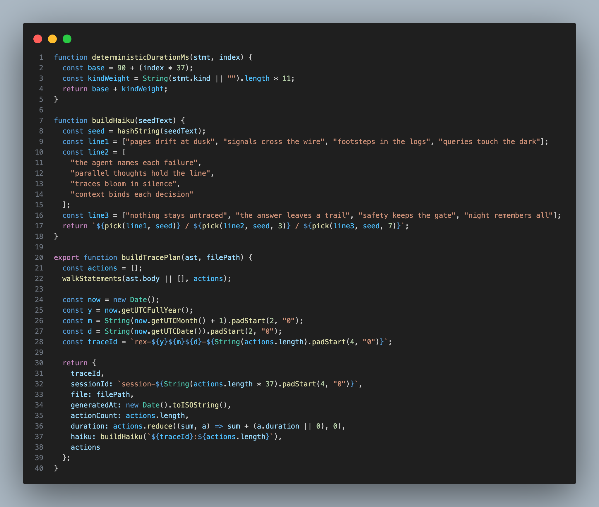
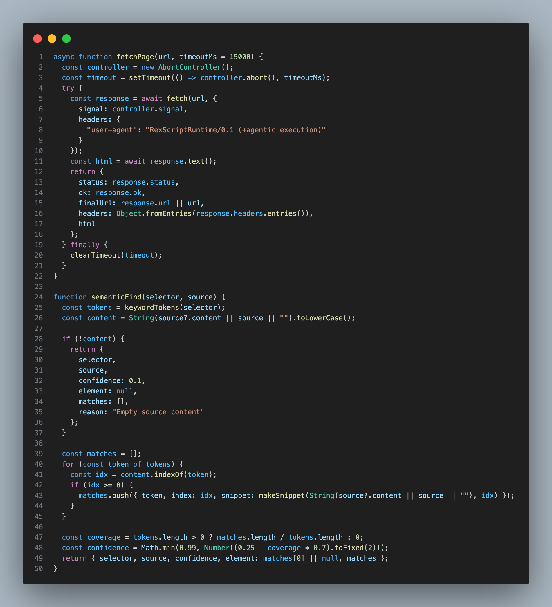
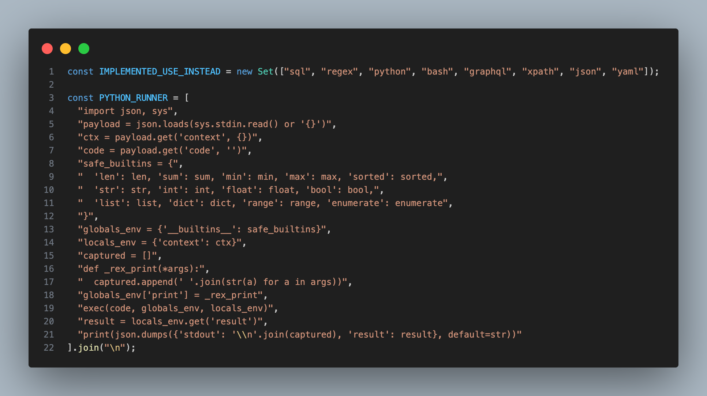
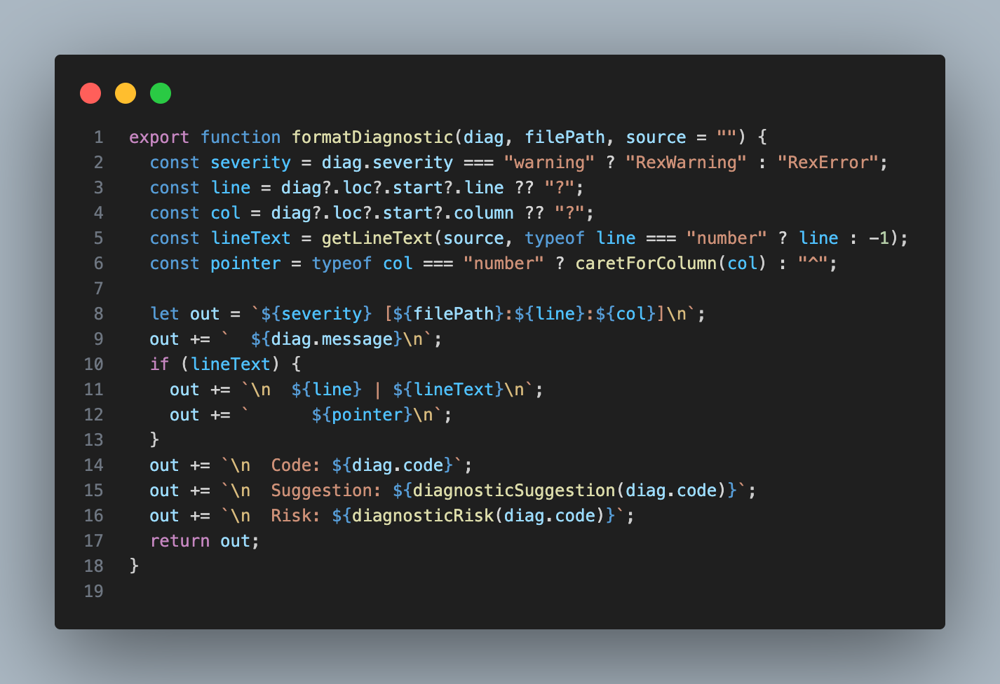

## Tracing Model

RexScript generates two distinct trace artifacts:

- Plan trace (compiler-side): deterministic action plan
- Runtime trace (execution-side): real decisions, results, and diagnostics

Trace fields include:

- `traceId`, `sessionId`, `file`, `generatedAt`
- `actions[]` with `action`, `riskLevel`, `capability`, `xriskDecision`, `policyReason`, `duration`, `loc`
- `diagnostics` with warning/error payloads

Relevant files:

- [compiler/src/trace-plan.js](compiler/src/trace-plan.js)
- [tests/integration/trace.schema.json](tests/integration/trace.schema.json)
- [tests/integration/validate-trace-schema.js](tests/integration/validate-trace-schema.js)

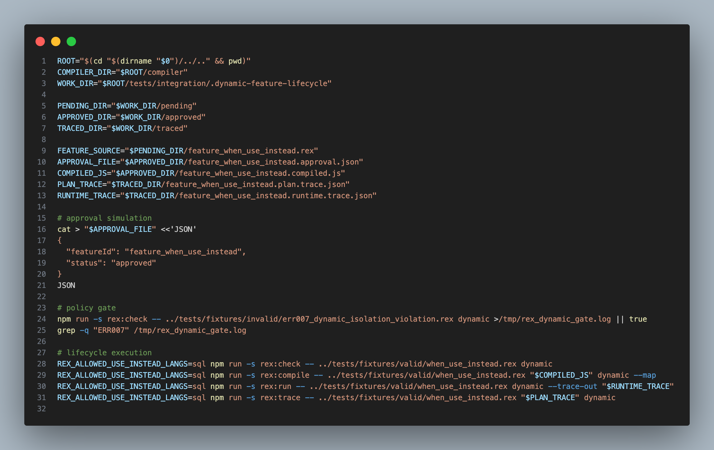


## Dynamic Feature Lifecycle

Phase 5 introduced a gated dynamic feature flow:

1. `pending`: feature source appears in lifecycle workspace
2. `approved`: approval artifact must exist and be valid
3. `compiled`: feature compiles under dynamic mode and policy allowlists
4. `traced`: plan and runtime traces are persisted and validated

Primary script:

- [tests/integration/dynamic-feature-lifecycle.sh](tests/integration/dynamic-feature-lifecycle.sh)

Validator:

- [tests/integration/dynamic-feature-lifecycle-check.js](tests/integration/dynamic-feature-lifecycle-check.js)


## Validation Suite

Recommended full run order:

```bash
cd rexscript/compiler
npm run -s phase1:smoke && \
	npm run -s codegen:snapshots && \
	npm run -s integration:run && \
	npm run -s integration:trace-schema && \
	npm run -s integration:runtime-trace-schema && \
	npm run -s integration:runtime-behavior && \
	npm run -s integration:compiler-policy && \
	npm run -s integration:runtime-trace-metadata && \
	npm run -s integration:diagnostic-format && \
	npm run -s integration:dynamic-feature-lifecycle
```


## Screenshots And CodeSnap Workflow

Everything needed for README screenshots is pre-scaffolded:

- Manifest with exact target names: [assets/screenshot-manifest.md](assets/screenshot-manifest.md)
- Snippet sources for capture: [assets/code-chunks](assets/code-chunks)
- Destination folder for final PNG files: [assets/screenshots](assets/screenshots)

Process:

1. Open a snippet file from [assets/code-chunks](assets/code-chunks)
2. Capture with CodeSnap
3. Save using exact filename from [assets/screenshot-manifest.md](assets/screenshot-manifest.md)
4. Commit and push

## Roadmap Docs

- Phase 1 freeze: [docs/phase-1-freeze.md](docs/phase-1-freeze.md)
- Phase 3 prep: [docs/phase-3-prep.md](docs/phase-3-prep.md)
- Phase 4 prep: [docs/phase-4-prep.md](docs/phase-4-prep.md)
- Phase 3-5 roadmap: [docs/phase-3-5-roadmap.md](docs/phase-3-5-roadmap.md)

---

If you are preparing GitHub launch materials, complete the screenshot set first, then this README is fully publication-ready.
